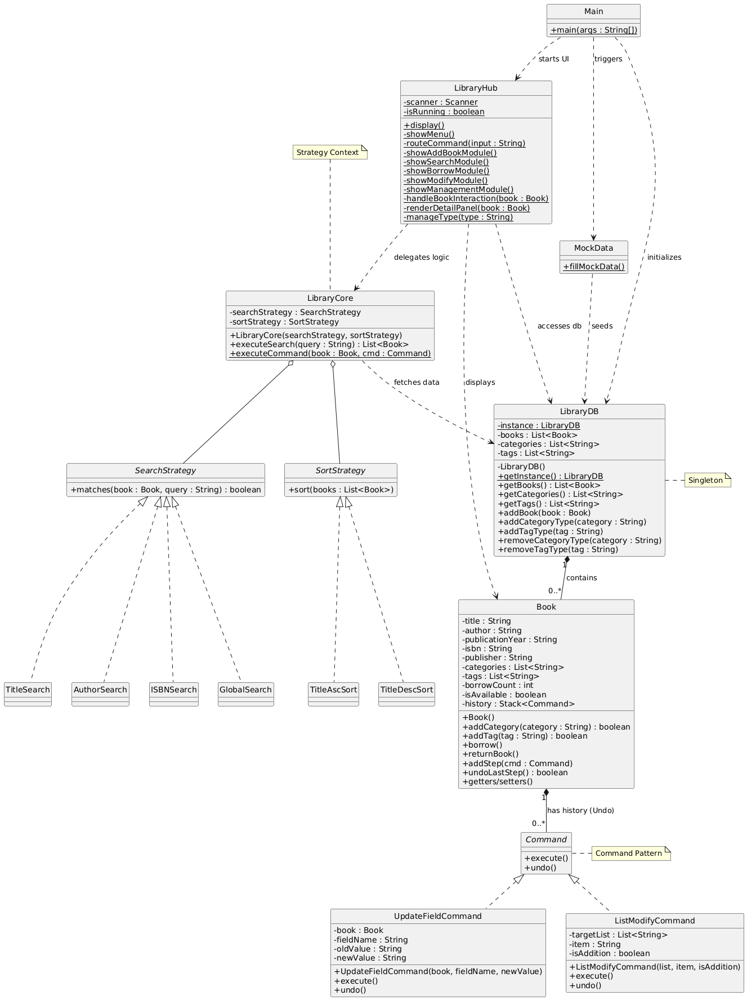

# Console Library Hub

library application i built to practice OOP and design patterns  
check out the project report in docs folder for design pattern analysis

## Design Patterns Analysis

### Strategy Pattern (Search & Sort Engine)
The Strategy pattern is used to decouple the search and sort logic from the LibraryCore context.

* **The Problem**: Adding new search types or sort orders should not require modifying the core execution class.
* **Implementation**: SearchStrategy and SortStrategy interfaces are defined. Concrete classes like AuthorSearch and TitleDescSort implement the specific matching algorithms.
* **Effect on Runtime**: The LibraryCore decides which algorithm to execute based on the user's menu selection at runtime, ensuring the "Open-Closed Principle" is maintained.

---

### Singleton Pattern (Data Persistence Layer)
The LibraryDB class ensures that the entire application operates on a single source of truth.

* **The Problem**: Multiple instances of a database would lead to data inconsistency across different modules.
* **Implementation**: A private constructor and a static getInstance() method were implemented to provide global access to the book catalog and system tags.
* **Effect on Runtime**: It ensures that when a book is added or modified in one module, the change is instantly reflected across all other modules.

---

### Command Pattern (Book Modification & Undo)
To support the requirement of reverting the most recent modification, the Command pattern was implemented.

* **The Problem**: Tracking the state of a book before and after multiple updates (Title, ISBN, Categories) is complex to manage manually.
* **Implementation**: Each modification is encapsulated in a Command object (UpdateFieldCommand or ListModifyCommand) which stores the oldValue and newValue.
* **Undo Mechanism**: Each Book object contains a Stack<Command>. When the user selects "Undo", the system pops the last command and calls its undo() method to restore the previous state.